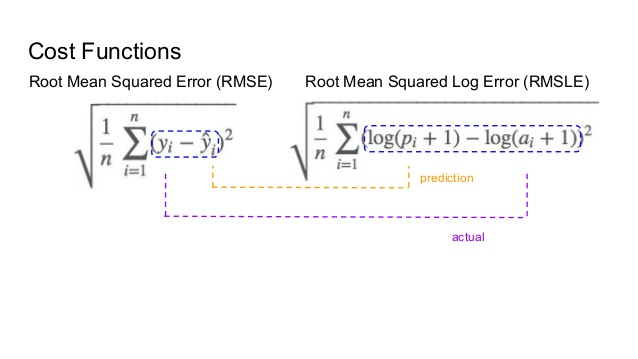

# Bike-Rentals-Regression-Problem-

This notebook is based on Prediction of total number of bikes on rent in an hour. It is a Regression Problem. The Dataset is taken from [kaggle](https://www.kaggle.com/c/bike-sharing-demand/data).using Gradient Boost regressor i reduced Root Mean Squared Log Error (RMSLE) to 0.33.

Since the dataset provided has no null values, it does not need cleaning. hence this Step is skipped while working.

The workflow is as follows:

1. Exploratory Data Analysis.

2. Correlation of features

3. Feature Engineering

4. RMSLE score

5. Modelling

    5.1. Linear Regression model without Regularization

    5.2. Regularization Models.

        5.2.1. Ridge Regression

        5.2.3. LASSO Regression

    5.3. Random Forest Regressor

    5.4. Gradient Boost Regressor

## Metric:

The metric of the competition is Root Mean Squared Log Error (RMSLE)

## Findings:
1. There are more number of registered users as compared to casual users.
2. bikes are rented more on working days at peak timings at 9am, 5pm-6pm. This is beacuse in most of the metroploitan cities this is the peak office time and so more people would be renting bikes. this is just one of the plausible reason.
3. Rentals are lowest in Spring season due to rainy weather. Highest in Fall, Summer, Winter season due to clear sky or Slightly Cloudy sky.
4. The number of bikes on rent increased in year 2012. 
5. Target(Count) is Right Skewed. hence Logarithmic Transformation is used for prediction.
